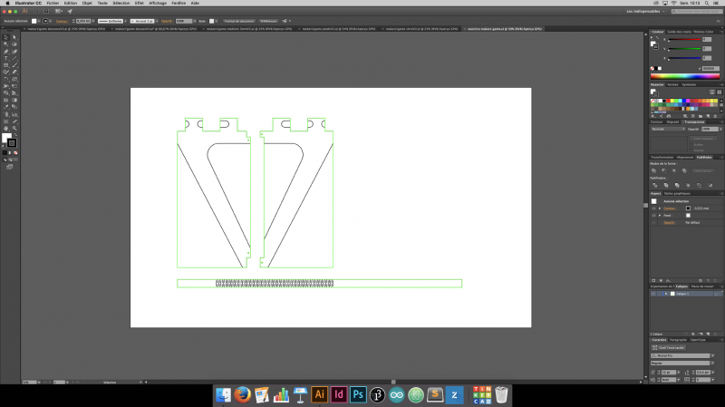

# makers-game


## Matériel

- 3 planches de contre-plaqué (1000x600x10mm)
- 1 planche de médium (1000x600x3mm)
- 1 planche de PMMA coulé (35x400mm)
- 1 carte Arduino Uno
- 1 carte epoxy
- 1 Raspberry Pi (fonctionne avec la pi 1 Modèle B )
- 4m de ruban de LED
- papier de verre
- 30 vis à bois (2,5 x 20mm)   

Vous aurez aussi besoin d'avoir accès à:
- 1 découpe laser
- 1 fer à souder
- 1 perceuse-visseuse
- 1 pistollet à colle  


## Step 1 - Découper les pièces

Dans l’onglet fichiers, **télécharger les documents**.
Et **découper à la laser** :  

En **contre-plaqué de 10mm d’épaisseur**:
- pieds de la table (x4)
- plateau du dessous (x1)
- plateau du dessus avec pièces annexes (x1)  
Poncer les rebords des découpes afin d’obtenir un rendu propre.  


En **médium de 3mm d’épaisseur**:
-	bandeaux contours de la table (x4)
-	quadrillage intérieur (x1)  

En **PMMA**:
- vitre de la table (x1)





## Step 2 - Assembler la table

**Assembler les pieds**:
- Nettoyer soigneusement les trous taraudés des vis.
- Visser les planches de bois deux à deux avec des vis à bois.
- Insérer les 4 pieds dans le plateau du dessous et visser.  
*Attention à ne pas abimer les encoches !*  


**Assembler la grille**:
- Vous munir de patience !
- Les lattes verticales et horizontales doivent être totalement enfoncées les unes dans les autres.

**Mettre en place le bandeau**:
- Trouver le milieu de la largeur et notez-le sur la cale en bois.
- Placer le flexwood à partir du milieu de la cale en bois.
- Coller le flexwood (mettre de la colle à bois sur les parties ou il y a les cales).
- Pour rejoindre les 2 bouts de flexwood : collez un petit bout de medium 3mm permettant de les réunir et de solidifier l’ensemble.


## Step 3 - Préparer et installer le ruban de LED

- Nous avons utilisé le ruban de leds **Adafruit Neopixel** (11 x 19 = 209 leds).
- Couper votre ruban en 19 rubans de 11 leds.
- Souder les extrémités de vos rubans de façon à réaliser un « serpent » (cf. photo): GND - GND /  DIN - DOUT / 5V - 5V. *Attention: la longueur de vos fils doit être suffisante pour pouvoir disposer les leds comme sur la photo.*
- Une fois les soudures réalisées, les fixer avec un point de pistolet à colle.
- Placer le ruban LED sur la table. Faire en sorte que chaque LED soit à peu près au milieu de chaque case de la grille. Les câbles doivent pouvoir passer entre les encoches supérieures des pieds.
- Connecter votre ruban de led à l'Arduino Uno (pin 6)
- Tester les soudures de votre ruban à l’aide de l’Arduino Uno. Pour cela, nous utilisons l’exemple « Simple » de la [librairie « Adafruit Neopixel »](https://github.com/adafruit/Adafruit_NeoPixel). Vérifier que toutes vos led s'allument correctement.
- Une fois testé, disposer parfaitement votre ruban de leds et enfoncer la grille dans le plateau du dessous de la table.
- Téléverser le programme disponible sur Github: « arcadeTable_arduino » // https://github.com/emlyon/arcadeTable

// IMAGE BRANCHEMENT LED//


## Step 4 - Programmer la Raspberry Pi
**Installer le système de la Raspberry Pi**:
Télécharger et copier l’image de [Raspbian Stretch Lite](https://downloads.raspberrypi.org/raspbian_lite_latest) sur votre Raspberry Pi en utilisant [Etcher.io](https://etcher.io/).  
Vous pouvez suivre le guide [installing operating system images](https://www.raspberrypi.org/documentation/installation/installing-images/README.md) pour plus de détails.  
Démarrez votre Raspberry Pi avec un clavier, un câble ethernet relié à votre box internet et un écran branchés.  
( identifiant par défaut: pi / mot de passe: raspberry )  
Une fois identifié, vous pouvez taper: `sudo raspi-config` pour configurer la langue du clavier ( en français: http://www.tropfacile.net/doku.php/raspberry-pi/comment-passer-votre-raspberry-en-francais )  
Installez openFrameworks en suivant le guide suivant: [Getting your Raspberry Pi ready for openFrameworks](http://openframeworks.cc/setup/raspberrypi/raspberry-pi-getting-started/)  
Une fois openFrameworks installé et testé, vous pouvez maintenant télécharger le code des jeux et le compiler:
```
cd /home/pi/openFrameworks/apps/myApps/
git clone https://github.com/emlyon/arcadeTable.git
make
```
Ne lancez pas le programme maintenant: si l'arduino n'est pas branchée, le programme ne peut pas fonctionner.  
Pour que le jeu se lance automatiquement au démarrage, éditez le fichier `rc.local`:  
```
sudo nano /etc/rc.local
```
Et ajouter avant la ligne `exit`:
```
su pi -c 'cd /home/pi/openFrameworks/apps/myApps/arcadeTable && make run'
```
Faites `Ctrl+x` pour quitter, puis `y` pour sauvegarder.


## Step 5 - Installer les boutons d’arcade

**Préparer les boutons**:
- Souder des fils électriques sur les pins des boutons:  
10 fils de 100cm 'pour les 5 boutons du "Player 2"   
10 de 25 cm (pour les 5 boutons du "Player 1"
-  Fixer les boutons sur le dessus de la table. Pour cela:  
Retirer l'écrou.  
Couper l'anneau en deux points afin d'en retirer à peu près 1/3.  
Placer le bouton dans le trou prévu pour le revoir et le fixer en serrant l'anneau par dessous.

// AJOUTER SCHEMA FRITZING //

**Réaliser le montage électronique**:
- Utiliser une plaque de prototype pour réaliser vos soudures.
- Attention: l’Arduino Uno, la Raspberry Pi et l’alimentation seront du côté du « Player 1 ». Il faut donc une certaine longueur de fil pour les boutons d’arcade du « Player 2 ».
- Utiliser des cables male - femelle pour les pins destinées à être connectées au Raspberry Pi.  

Voici les **branchements des 10 boutons sur la Raspberry Pi**:  

Player 1 - UP button: pin 23  
Player 1 - DOWN button: pin 24  
Player 1 - LEFT button: pin 10  
Player 1 - RIGHT button: pin 9  
Player 1 - RESET button: pin 11  

Player 2 - UP button: pin 4  
Player 2 - DOWN button: pin 17  
Player 2 - LEFT button: pin 18  
Player 2 - RIGHT button: pin 27  
Player 2 - RESET button: pin 22

 // IMAGE PINOUT//


## Step 6 - Finaliser la table

- A l’aide d’une perceuse réaliser un trou de 10mm de diamètre au niveau de l’alimentation dans le bandeaux de contour de la table.
- Y insérer le connecteur pour l’alimentation 5V.
- Placer l'électronique et les câbles afin de pouvoir fermer la table.
- Positionner le dessus de la table correctement et le fixer à l'aide des vis à bois.
- Mettre en place la vitre en PMMA au dessus de la grille. Celle-ci doit être maintenue par le dessus de la table.  

#### Vous êtes arrivé à bout, bien joué !
