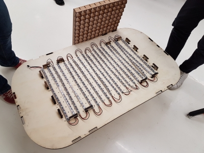
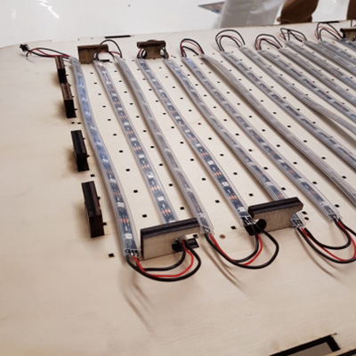
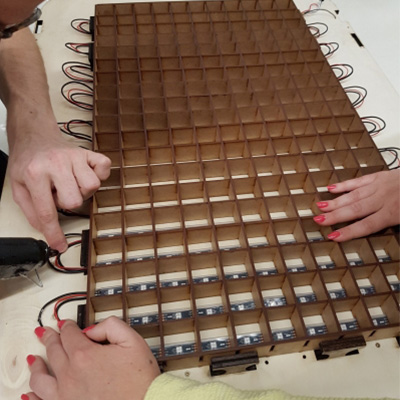
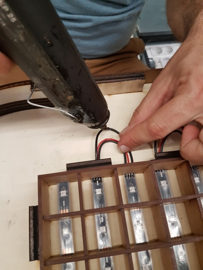
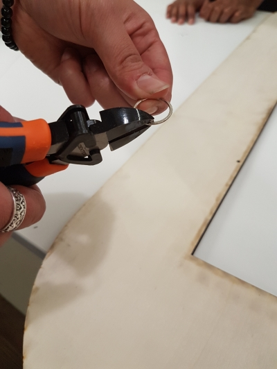
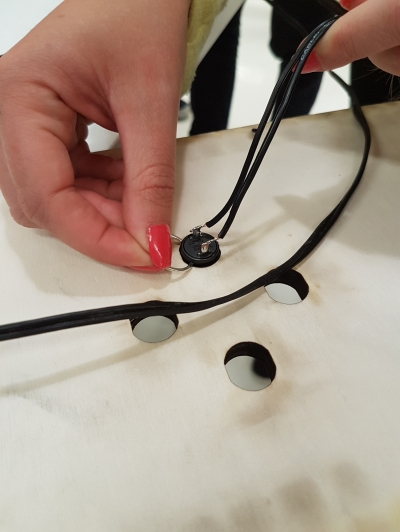
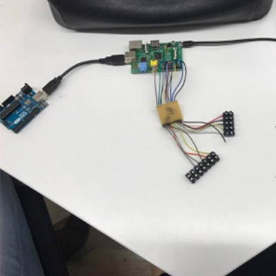
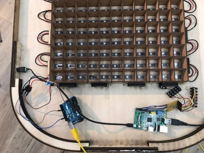

# makers-game


## Matériel

- 3 planches de contre-plaqué (1000x600x10mm)
- 1 planche de médium (1000x600x3mm)
- 1 planche de PMMA coulé (35x400mm)
- 1 [carte Arduino Uno](https://www.amazon.fr/Elegoo-ATmega328P-ATMEGA16U2-Controller-Microcontr%C3%B4leur/dp/B01N91PVIS/ref=sr_1_3?ie=UTF8&qid=1546870406&sr=8-3&keywords=arduino+uno)
- 1 [carte epoxy](https://www.amazon.fr/RainBabe-Double-Spray-Universelle-Exp%C3%A9rimentale/dp/B07KG66915/ref=sr_1_2?s=hi&ie=UTF8&qid=1546870677&sr=1-2&keywords=carte%2Bepoxy&th=1)
- 1 [Raspberry Pi (Pi 1 Modèle B)](https://www.amazon.fr/Raspberry-Pi-Carte-M%C3%A8re-Model/dp/B01CD5VC92/ref=sr_1_3?ie=UTF8&qid=1546870736&sr=8-3&keywords=raspberry+pi+3)
- 1 [carte SD](https://www.amazon.fr/SanDisk-SDSQUAR-016G-GN6MA-M%C3%A9moire-MicroSDHC-Nouvelle/dp/B073K14CVB/ref=sr_1_12?s=electronics&ie=UTF8&qid=1546874053&sr=1-12&keywords=carte+micro+sd)
- 1 [cable micro USB](https://www.amazon.fr/Samsung-ECB-DU4AWE-C%C3%A2ble-charge-Blanc/dp/B00BCJVMPK/ref=sr_1_24?s=electronics&rps=1&ie=UTF8&qid=1546877205&sr=1-24&keywords=cable+usb+micro+usb&refinements=p_76%3A437879031)
- 1 [cable USB A/MicroB](https://www.amazon.fr/C%C3%A2ble-2-0-M%C3%A2le-couleur-gris/dp/B00O2BKHJM/ref=sr_1_5?ie=UTF8&qid=1546872286&sr=8-5&keywords=cable+usb+ab) **(Normalement présent avec la carte Arduino)**
- 7m de [ruban de LED](https://www.amazon.fr/gp/product/B01HLWW9VC/ref=oh_aui_detailpage_o08_s00?ie=UTF8&psc=1)       **(Attention, Vous aurez besoin de 7m donc 2 rouleaux de 5m)**
- papier de verre **(Disponible au Makers' lab)**
- 10 vis à bois (2,5 x 20mm) **(Disponible au Makers' lab)**
- 2 [condensateurs 10uF](https://www.amazon.fr/Condensateur-chimique-radial-10uF-5x12mm/dp/B074CY3YVL/ref=pd_sbs_60_1?_encoding=UTF8&pd_rd_i=B074CY3YVL&pd_rd_r=c44c0817-1288-11e9-9b0f-01dc7c5858cd&pd_rd_w=x3iHt&pd_rd_wg=HhaR7&pf_rd_p=5d361e0c-9e85-4b01-8261-3ff932bec9c8&pf_rd_r=ZM36A88VESV4N7ASMRZT&psc=1&refRID=ZM36A88VESV4N7ASMRZT)
- 10 [resistances de 10kΩ](https://www.amazon.fr/resistor-film-carbone-resistances-axiales/dp/B01FSDLV1K/ref=sr_1_5?ie=UTF8&qid=1546871577&sr=8-5&keywords=r%C3%A9sistance+10k+ohm)
- 1 [alimentation 5V 10A](https://www.amazon.fr/COLM-Adaptateur-Secteur-100-240V-transformateur/dp/B07M5ZXRPG/ref=sr_1_2?ie=UTF8&qid=1546872597&sr=8-2&keywords=power+supply+5v+10a)
- 1 [adaptateur femelle](https://www.amazon.fr/Connecteur-broches-alimentation-polaris%C3%A9-Adaptateur/dp/B0754KK8V3/ref=sr_1_5?ie=UTF8&qid=1546872955&sr=8-5&keywords=adaptateur+DC+bornier)
- 10 [boutons arcade](https://www.amazon.fr/gp/product/B01N5DVINY/ref=oh_aui_detailpage_o09_s00?ie=UTF8&psc=1)

Vous aurez aussi besoin d'avoir accès à:
- 1 découpe laser
- 1 fer à souder et un nécessaire de soudure
- 1 perceuse-visseuse
- 1 pistollet à colle  
- 1 tube de colle à bois

## Disclamer : Work in Progress


## Step 1 - Découper les pièces

Dans l’onglet fichiers, **télécharger les documents**.
Et **découper à la laser** :  

En **contre-plaqué de 10mm d’épaisseur**:
- pieds de la table (x4)
- plateau du dessous (x1)
- plateau du dessus avec pièces annexes (x1) **(Si vous souhaitez personnaliser votre table, c'est ce fichier qui sera visible)**

- Poncer les rebords des découpes afin d’obtenir un rendu propre.  


En **médium de 3mm d’épaisseur**:
-	bandeaux contours de la table (x4)
-	quadrillage intérieur (x1)  

En **PMMA**:
- vitre de la table (x1)


## Step 2 - Assembler la table

**Assembler les pieds**:
- Nettoyer soigneusement les trous taraudés des vis.
- Visser les planches de bois deux à deux avec des vis à bois.
- Insérer les 4 pieds dans le plateau du dessous et visser.  
*Attention à ne pas abimer les encoches !*  


**Assembler la grille**:
- Vous munir de patience !
- Les lattes verticales et horizontales doivent être totalement enfoncées les unes dans les autres.

**Mettre en place le bandeau**:
- Emboiter les 6 cales de CP 10mm aux emplacements sur le plateau du dessous et les fixer avec des vis à bois.
- Une fois les cales vissées, placer les 4 pièces découpées en amont pour les angles arrondis de la table.
- Trouver le milieu de la largeur de chaque bandeau et le marquer sur la cale en bois.
- Placer le flexwood à partir du milieu de la cale en bois.
- Coller le flexwood (mettre de la colle à bois sur les parties ou il y a les cales).
- Pour rejoindre les 2 bouts de flexwood : collez un petit bout de medium 3mm permettant de les réunir et de solidifier l’ensemble.


## Step 3 - Préparer et installer le ruban de LED

- Nous avons utilisé le ruban de leds **Adafruit Neopixel** (11 x 19 = 209 leds).
- Couper votre ruban en 11 rubans de 19 leds.
- Souder les extrémités de vos rubans de façon à réaliser un « serpent » (cf. photo): GND - GND /  DIN - DOUT / 5V - 5V. *Attention: la longueur de vos fils doit être suffisante pour pouvoir disposer les leds comme sur la photo.*
- Placer le ruban LED sur la table. Faire en sorte que chaque LED soit à peu près au milieu de chaque case de la grille. Les câbles doivent pouvoir passer entre les encoches supérieures des pieds.
- Connecter votre ruban de led à l'Arduino Uno (pin 6)
- Tester les soudures de votre ruban à l’aide de l’Arduino Uno. Pour cela, nous utilisons l’exemple « Simple » de la [librairie « Adafruit Neopixel »](https://github.com/adafruit/Adafruit_NeoPixel). Vérifier que toutes vos led s'allument correctement.
- Une fois les soudures testées, les fixer avec un point de pistolet à colle.
- Disposer parfaitement votre ruban de leds et enfoncer la grille dans le plateau du dessous de la table.
- Téléverser le programme disponible sur Github: « arcadeTable_arduino » // https://github.com/emlyon/arcadeTable







## Step 4 - Programmer la Raspberry Pi
#### A partir d'ici, deux solutions s'offrent à vous :
- Télécharger et copier sur la microSD l'image finale de la table. [ici](#code)
- Prendre le temps de modifier le code existant pour mieux comprendre son fonctionnement.

**Installer le système de la Raspberry Pi**:  
Télécharger et copier l’image de [Raspbian Stretch Lite](https://downloads.raspberrypi.org/raspbian_lite_latest) sur votre Raspberry Pi en utilisant [Etcher.io](https://etcher.io/).  
Vous pouvez suivre le guide [installing operating system images](https://www.raspberrypi.org/documentation/installation/installing-images/README.md) pour plus de détails.  
Démarrer votre Raspberry Pi avec un clavier, un câble ethernet relié à votre box internet et un écran branchés.  
( identifiant par défaut: pi / mot de passe: raspberry )  
Une fois identifié, vous pouvez taper: `sudo raspi-config` pour configurer la langue du clavier ( en français: http://www.tropfacile.net/doku.php/raspberry-pi/comment-passer-votre-raspberry-en-francais )  
Installez openFrameworks en suivant le guide suivant: [Getting your Raspberry Pi ready for openFrameworks](http://openframeworks.cc/setup/raspberrypi/raspberry-pi-getting-started/)  
Une fois openFrameworks installé et testé, vous pouvez maintenant télécharger le code des jeux et le compiler:
```
cd /home/pi/openFrameworks/apps/myApps/
git clone https://github.com/emlyon/makers-game-code.git
make
```
Ne lancez pas le programme maintenant: si l'arduino n'est pas branchée, le programme ne peut pas fonctionner.  
Pour que le jeu se lance automatiquement au démarrage, éditez le fichier `rc.local`:  
```
sudo nano /etc/rc.local
```
Et ajouter avant la ligne `exit`:
```
su pi -c 'cd /home/pi/openFrameworks/apps/myApps/makers-game-code && make run'
```
Faites `Ctrl+x` pour quitter, puis `y` pour sauvegarder.

<a id="code"></a>

**Si vous avez chosit la facilité :**

Flasher cette [image](https://github.com/emlyon/makers-game-code/tree/master/image_raspberry_finale) grâce au logiciel Etcher et insérer la microSD dans la Raspberry Pi.

## Step 5 - Installer les boutons d’arcade

**Préparer les boutons**:
- Souder des fils électriques sur les pins des boutons:  
10 fils de 100cm 'pour les 5 boutons du "Player 2"   
10 de 25 cm (pour les 5 boutons du "Player 1"
-  Fixer les boutons sur le dessus de la table. Pour cela:  
Retirer l'écrou.  
Couper l'anneau en deux points afin d'en retirer à peu près 1/3.  
Placer le bouton dans le trou prévu pour le revoir et le fixer en serrant l'anneau par dessous.




**Réaliser le montage électronique**:
- Utiliser une plaque de prototype pour réaliser vos soudures.
- Attention: l’Arduino Uno, la Raspberry Pi et l’alimentation seront du côté du « Player 1 ». Il faut donc une certaine longueur de fil pour les boutons d’arcade du « Player 2 ».
- Utiliser des cables male - femelle pour les pins destinées à être connectées au Raspberry Pi.
- Utiliser des cables male - male pour les pins destinées à être connectées sur l'Arduino Uno.

  

**Ne pas oublier** de:  
Connecter l'Arduino Uno à la Raspberry Pi à l'aide d'un cable USB-USB.  
Alimenter la Raspberry pi à l'aide d'un cable micro-USB: brancher la micro-USB à la Raspberry pi et dénuder l'autre côté afin de connecter les fils au condensateur.

Voici les **branchements des 10 boutons sur la Raspberry Pi**:  

Player 1 - UP button: pin 23  
Player 1 - DOWN button: pin 24  
Player 1 - LEFT button: pin 10  
Player 1 - RIGHT button: pin 9  
Player 1 - RESET button: pin 11  

Player 2 - UP button: pin 4  
Player 2 - DOWN button: pin 17  
Player 2 - LEFT button: pin 18  
Player 2 - RIGHT button: pin 27  
Player 2 - RESET button: pin 22  

**[Raspberry Pi pinout](http://opensourceforu.com/wp-content/uploads/2017/06/Figure-1-Raspberry-Pi-pinout-diagram.jpg)**  




## Step 6 - Finaliser la table

- A l’aide d’une perceuse réaliser un trou de 10mm de diamètre au niveau de l’alimentation dans le bandeaux de contour de la table.
- Y insérer le connecteur pour l’alimentation 5V.
- Placer l'électronique et les câbles afin de pouvoir fermer la table.
- Positionner le dessus de la table correctement et le fixer à l'aide des vis à bois.
- Mettre en place la vitre en PMMA au dessus de la grille. Celle-ci doit être maintenue par le dessus de la table.  

  

#### Vous êtes arrivé à bout, bien joué !


