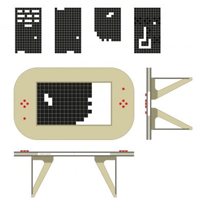
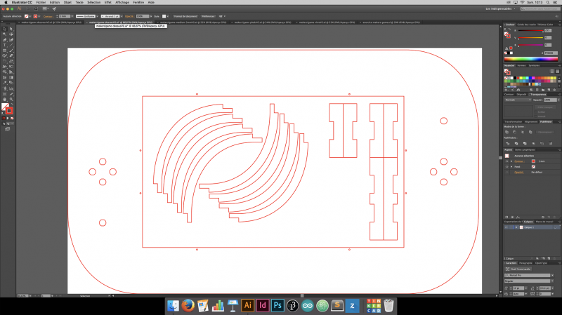
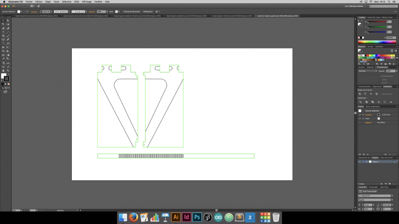
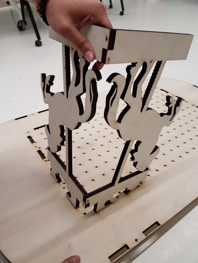
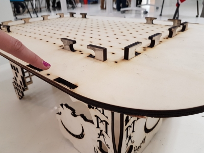
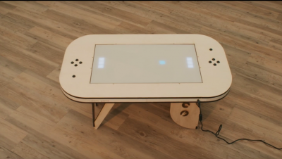

# makers-game

<h2>Step 1 - Découper les pièces</h2>

Dans l’onglet fichiers, <b>télécharger les documents</b>.
Et <b>découper à la laser</b> :
  
En contre-plaqué de 10mm d’épaisseur:

- pieds de la table (x4)
- plateau du dessous (x1)
- plateau du dessus avec pièces annexes (x1) 
Poncer les rebords des découpes afin d’obtenir un rendu propre.

En médium de 3mm d’épaisseur:
-	4 x bandeaux contours de la table (médium)
-	1 x quadrillage intérieur (x1)

<h2>Step 2 - Assembler la table</h2>

Assembler les pieds:
- Nettoyer soigneusement les trous taraudés des vis.
- Visser les planches de bois deux à deux avec des vis à bois (2,5 x 20mm)
- Insérer les 4 pieds dans le plateau du dessous et visser
 Attention à ne pas abimer les encoches !

Assembler la grille:
- Vous munir de patience !
- Les lattes verticales et horizontales doivent être bien totalement enfoncées les unes dans les autres.

Mettre en place le bandeau:
- Trouver le milieu de la largeur et notez-le sur la cale en bois.
- Placer le flexwood à partir du milieu de la cale en bois
- Coller le flexwood (mettre de la colle à bois sur les parties ou il y a les cales).
- Pour rejoindre les 2 bouts de flexwood : collez un petit bout de medium 3mm permettant de les réunir et de solidifier l’ensemble.

<h2>Step 3 - Préparer et installer le ruban de LED</h2>

- Nous avons utilisé le ruban de leds Adafruit Neopixel (11 x 19 = 209 leds).
- Couper votre ruban en 19 rubans de 11 leds.
- Souder les extrémités de vos rubans de façon à réaliser un « serpent » (cf. photo): GND - GND /  DIN - DOUT / 5V - 5V. Attention: la longueur de vos fils doit être suffisante pour pouvoir disposer les leds comme sur la photo.
- Une fois les soudures réalisées, les fixer avec un point de pistolet à colle.
- Placer le ruban LED sur la table. Faire en sorte que chaque LED soit à peu près au milieu de chaque case de la grille. Les câbles doivent pouvoir passer entre les encoches supérieures des pieds.
- Connecter votre ruban de led à l'Arduino Uno (pin 6)
- Tester les soudures de votre ruban à l’aide de l’Arduino Uno. Pour cela, nous utilisons l’exemple « Simple » de la <a href="https://github.com/adafruit/Adafruit_NeoPixel">librairie « Adafruit Neopixel »</a>. Vérifier que touts vos led s'allument correctement.
- Une fois testé, disposer parfaitement votre ruban de legs et enfoncer la grille dans le plateau du dessous de la table.
- Téléverser le programme disponible sur Github: « arcadeTable_arduino » // https://github.com/emlyon/arcadeTable

// IMAGE BRANCHEMENT LED//

<h2>Step 4 - Programmer la Raspberry Pi 1</h2>

Télécharger et copier l’image sur la Raspberry Pi en utilisant Etcher.io  
Installer les jeux: Lionel HELP

<h2>Step 5 - Installer les boutons d’arcade</h2>

// AJOUTER SCHEMA FRITZING //
- Utiliser une plaque de prototype pour réaliser vos soudures.
- Attention: l’Arduino Uno, la Raspberry Pi et l’alimentation seront du côté du « Player 1 ». Il faut donc une certaine longueur de fil pour les boutons d’arcade du « Player 2 ».
- Utiliser des cables male - femelle pour les pins destinées à être connectées au Raspberry Pi.
  
Voici les branchements de boutton sur la Raspberry Pi:
Player 1 - UP button: pin 23 
Player 1 - DOWN button: pin 24 
Player 1 - LEFT button: pin 10 
Player 1 - RIGHT button: pin 9 
Player 1 - RESET button: pin 11 
Player 2 - UP button: pin 4 
Player 2 - DOWN button: pin 17 
Player 2 - LEFT button: pin 18 
Player 2 - RIGHT button: pin 27 
Player 2 - RESET button: pin 22

 // IMAGE PINOUT//

<h2>Step 6 - Finaliser la table</h2>

- A l’aide d’une perceuse réaliser un trou de 10mm de diamètre au niveau de l’alimentation dans le bandeaux de contour de la table.
- Y insérer le connecteur pour l’alimentation 5V.
