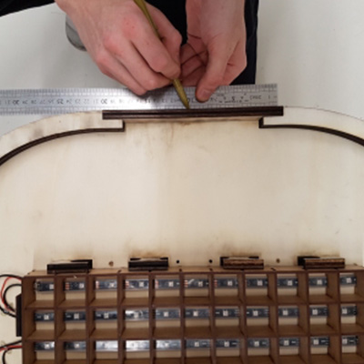
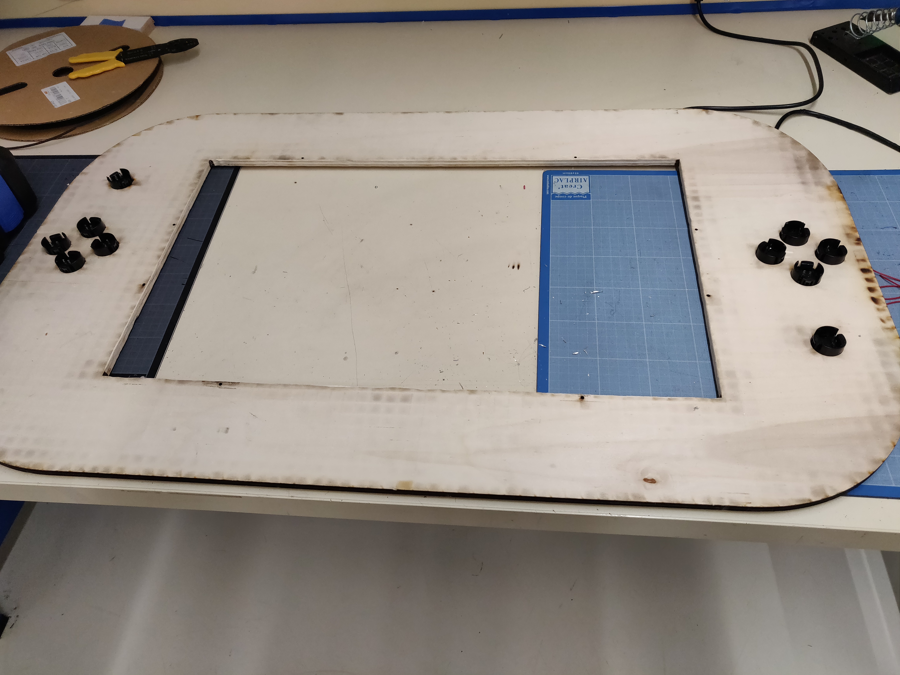
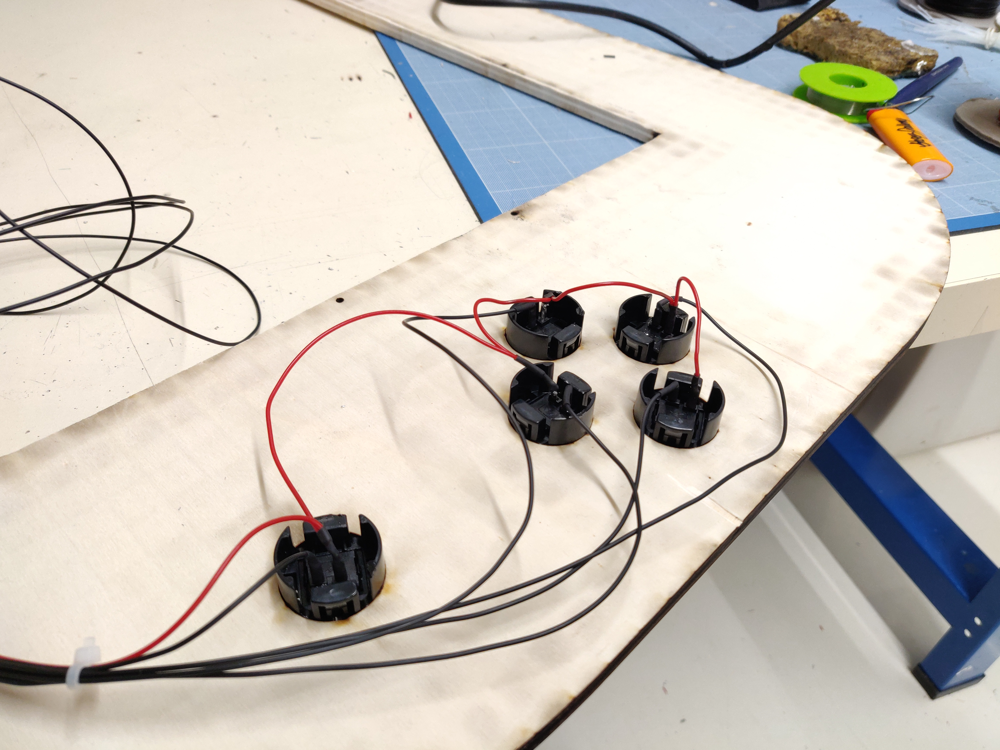
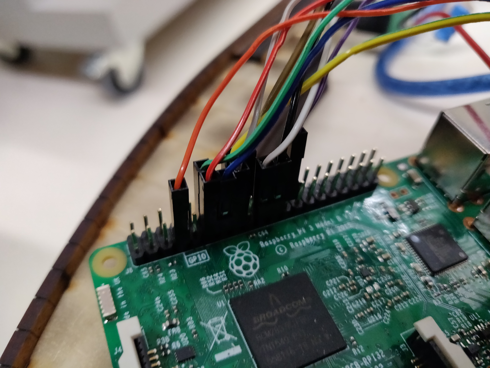
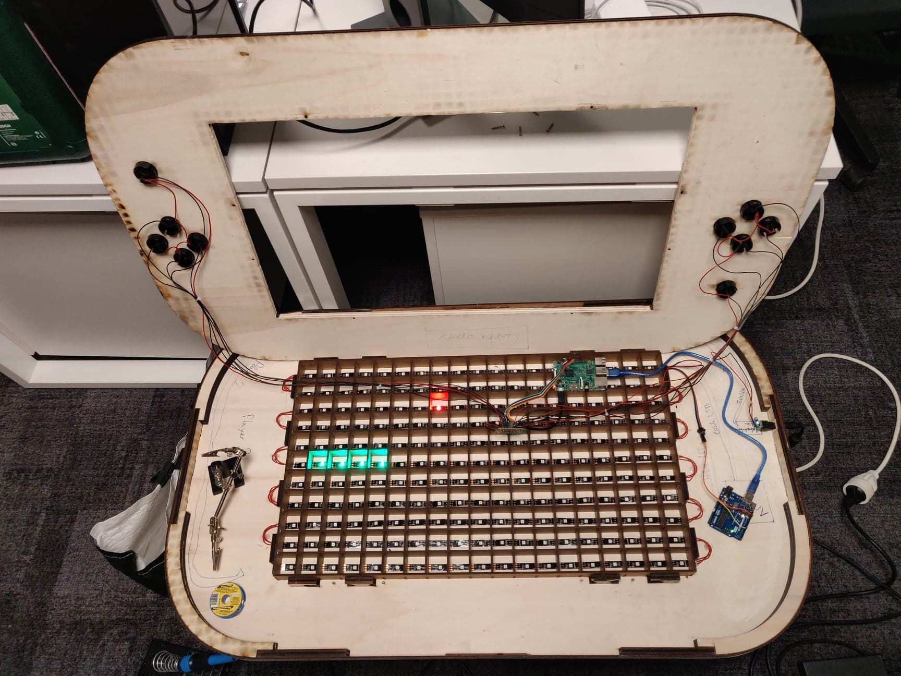

# makers-game


## Matériel

- 3 planches de contre-plaqué (1000x600x10mm)
- 1 planche de médium (1000x600x3mm)
- 1 planche de PMMA coulé (35x400mm)
- 1 [carte Arduino Uno](https://www.amazon.fr/Elegoo-ATmega328P-ATMEGA16U2-Controller-Microcontr%C3%B4leur/dp/B01N91PVIS/ref=sr_1_3?ie=UTF8&qid=1546870406&sr=8-3&keywords=arduino+uno)
- 1 [Breadboard epoxy](https://www.amazon.fr/Adafruit-Perma-Proto-Half-sized-Breadboard-PCB/dp/B00SK8QR8S/ref=sr_1_25?ie=UTF8&qid=1546954746&sr=8-25&keywords=adafruit)
- 1 [Raspberry Pi](https://www.amazon.fr/Raspberry-Pi-Carte-M%C3%A8re-Model/dp/B01CD5VC92/ref=sr_1_3?ie=UTF8&qid=1546870736&sr=8-3&keywords=raspberry+pi+3)
- 1 [carte micro SD 8Go ou plus](https://www.amazon.fr/Kingston-Carte-Micro-Classe-Adaptateur/dp/B001CQT0X4/ref=sr_1_1?ie=UTF8&qid=1547134978&sr=8-1&keywords=carte+micro+sd+8go)
- 1 [cable micro USB](https://www.amazon.fr/Samsung-ECB-DU4AWE-C%C3%A2ble-charge-Blanc/dp/B00BCJVMPK/ref=sr_1_24?s=electronics&rps=1&ie=UTF8&qid=1546877205&sr=1-24&keywords=cable+usb+micro+usb&refinements=p_76%3A437879031)
- 1 [cable USB A/MicroB](https://www.amazon.fr/C%C3%A2ble-2-0-M%C3%A2le-couleur-gris/dp/B00O2BKHJM/ref=sr_1_5?ie=UTF8&qid=1546872286&sr=8-5&keywords=cable+usb+ab) **(Normalement présent avec la carte Arduino)**
- 7m de [ruban de LED](https://www.amazon.fr/gp/product/B01HLWW9VC/ref=oh_aui_detailpage_o08_s00?ie=UTF8&psc=1)       **(Attention, Vous aurez besoin de 7m donc 2 rouleaux de 5m)**
- [papier de verre](https://www.amazon.fr/Wolfcraft-1741000-Rouleau-Auto-agrippant-Corindon/dp/B001CBZPJM/ref=sr_1_13?s=hi&ie=UTF8&qid=1547042105&sr=1-13&keywords=papier+de+verre) **(Disponible au Makers' lab)**
- 16 [vis à bois (2,5 x 20mm)](https://www.amazon.fr/Fischer-653020-Power-Fast-frais%C3%A9e-galvanis%C3%A9e/dp/B0070MD33W/ref=sr_1_1?ie=UTF8&qid=1547042054&sr=8-1&keywords=vis+%C3%A0+bois+%282%2C5+x+20mm%29) **(Disponible au Makers' lab)**
- [Fils de prototypage](https://www.amazon.fr/Ganvol-Assortiment-Multicolore-Prototypage-Raspberry/dp/B076ZM34TM/ref=sr_1_1?ie=UTF8&qid=1547021001&sr=8-1&keywords=fils+prototypage) **(Disponible au Makers' lab)**
- 2 [condensateurs 10uF](https://www.amazon.fr/Condensateur-chimique-radial-10uF-5x12mm/dp/B074CY3YVL/ref=pd_sbs_60_1?_encoding=UTF8&pd_rd_i=B074CY3YVL&pd_rd_r=c44c0817-1288-11e9-9b0f-01dc7c5858cd&pd_rd_w=x3iHt&pd_rd_wg=HhaR7&pf_rd_p=5d361e0c-9e85-4b01-8261-3ff932bec9c8&pf_rd_r=ZM36A88VESV4N7ASMRZT&psc=1&refRID=ZM36A88VESV4N7ASMRZT)
- 10 [resistances de 10kΩ](https://www.amazon.fr/resistor-film-carbone-resistances-axiales/dp/B01FSDLV1K/ref=sr_1_5?ie=UTF8&qid=1546871577&sr=8-5&keywords=r%C3%A9sistance+10k+ohm)
- 1 [alimentation 5V 10A](https://www.amazon.fr/COLM-Adaptateur-Secteur-100-240V-transformateur/dp/B07M5ZXRPG/ref=sr_1_2?ie=UTF8&qid=1546872597&sr=8-2&keywords=power+supply+5v+10a)
- 1 [adaptateur femelle](https://www.amazon.fr/Connecteur-broches-alimentation-polaris%C3%A9-Adaptateur/dp/B0754KK8V3/ref=sr_1_5?ie=UTF8&qid=1546872955&sr=8-5&keywords=adaptateur+DC+bornier)
- 10 [boutons arcade](https://www.amazon.fr/gp/product/B01N5DVINY/ref=oh_aui_detailpage_o09_s00?ie=UTF8&psc=1)

Vous aurez aussi besoin d'avoir accès à:
- 1 découpe laser
- 1 fer à souder et un nécessaire de soudure
- 1 perceuse-visseuse
- 1 pistolet à colle  
- 1 tube de colle à bois


## Step 1 - Découper les pièces

[Télécharger les documents](https://github.com/emlyon/makers-game/tree/master/fichiers)
& les **découper à la laser** :  

En **contre-plaqué de 10mm d’épaisseur**:
- pieds de la table (x4)
- plateau du dessous (x1)
- plateau du dessus avec pièces annexes (x1) **(Si vous souhaitez personnaliser votre table, c'est ce fichier qui sera visible)**

- Poncer les rebords des découpes afin d’obtenir un rendu propre.  


En **médium de 3mm d’épaisseur**:
-	bandeaux contours de la table (x4)
-	quadrillage intérieur (x1)  

En **PMMA**:
- vitre de la table (x1)


## Step 2 - Assembler la table

### Assembler les pieds :
- Nettoyer soigneusement les trous taraudés des vis.
- Visser les planches de bois deux à deux avec des vis à bois.
- Insérer les 4 pieds dans le plateau du dessous et visser.  
*Attention à ne pas abimer les encoches !*  


### Assembler la grille
- Vous munir de patience !
- Les lattes verticales et horizontales doivent être totalement enfoncées les unes dans les autres.

### Mettre en place le bandeau :
- Emboiter les 6 cales de CP 10mm aux emplacements sur le plateau du dessous et les fixer avec des vis à bois.
- Une fois les cales vissées, placer les 4 pièces découpées en amont pour les angles arrondis de la table.
- Trouver le milieu de la largeur de chaque bandeau et le marquer sur la cale en bois.
- Placer le flexwood à partir du milieu de la cale en bois.
- Coller le flexwood (mettre de la colle à bois sur les parties ou il y a les cales).
- Pour rejoindre les 2 bouts de flexwood : collez un petit bout de medium 3mm permettant de les réunir et de solidifier l’ensemble.





## Step 3 - Préparer et installer le ruban de LED

- Nous avons utilisé le ruban de leds **Adafruit Neopixel** (11 x 19 = 209 leds).

- Couper votre ruban en 11 rubans de 19 leds.

- Souder les extrémités de vos rubans de façon à réaliser un « serpent » (cf. photo): GND - GND /  DIN - DOUT / 5V - 5V. *Attention: la longueur de vos fils doit être suffisante pour pouvoir disposer les leds comme sur la photo.*

**Attention à bien souder les fils correctement : Les 5V/5V, DI/DO et GND/GND. Utiliser du câble de différentes couleurs vous donnera des repères plus efficaces.**

- Placer le ruban LED sur la table. Faire en sorte que chaque LED soit à peu près au milieu de chaque case de la grille. Les câbles doivent pouvoir passer entre les encoches supérieures des pieds.


- Connecter votre ruban de led à l'Arduino Uno (pin 6)

- Tester les soudures de votre ruban à l’aide de l’Arduino Uno. Pour cela, nous utilisons l’exemple « Simple » de la [librairie « Adafruit Neopixel »](https://github.com/adafruit/Adafruit_NeoPixel). Vérifier que toutes vos leds s'allument correctement.

- Une fois les soudures testées, les fixer avec un point de pistolet à colle.

- Disposer parfaitement votre ruban de leds et enfoncer la grille dans le plateau du dessous de la table.
- Téléverser le programme disponible sur Github: [arcadeTable_arduino](https://github.com/emlyon/arcadeTable)


## Step 4 - Programmer la Raspberry Pi
### A partir d'ici, deux solutions s'offrent à vous :
- Télécharger et flasher sur la microSD l'[image finale](https://mega.nz/#!o4VjVQBK!anL8pMjKyosJ1wq7HOHirDserNrnDiyaaCutvMq7loU) de la table avec [Etcher.io](https://etcher.io/).
- Prendre le temps de paramétrer la Raspberry pour mieux comprendre son fonctionnement ou modifier son comportement.

## Installer le système de la Raspberry Pi:  
Télécharger et copier l’image de [Raspbian Stretch Lite](https://downloads.raspberrypi.org/raspbian_lite_latest) sur votre Raspberry Pi en utilisant [Etcher.io](https://etcher.io/).  
Vous pouvez suivre le guide [installing operating system images](https://www.raspberrypi.org/documentation/installation/installing-images/README.md) pour plus de détails.  
Démarrer votre Raspberry Pi avec un clavier, un câble ethernet relié à votre box internet et un écran branchés.  
( identifiant par défaut: pi / mot de passe: raspberry ) **Attention, par défaut le clavier relié est en QWERTY, le mot de passe à taper est donc "rqspberry")**

Une fois identifié, vous pouvez taper: `sudo raspi-config` pour configurer la langue du clavier ( en français: http://www.tropfacile.net/doku.php/raspberry-pi/comment-passer-votre-raspberry-en-francais )  
Installez openFrameworks en suivant le guide suivant: [Getting your Raspberry Pi ready for openFrameworks](http://openframeworks.cc/setup/raspberrypi/raspberry-pi-getting-started/)  

Une fois openFrameworks installé et testé, vous pouvez maintenant installer git sur votre pi. Pour ce faire :
```
cd
sudo apt update
sudo apt install git
```
Vérifier que vous avez bien installé git :

```
git --version
```
Il faut maintenant télécharger ofxGPIO (important pour la gestion des boutons)
```
cd openFrameworks/addons
git clone https://github.com/kashimAstro/ofxGPIO.git
```
Il faut maintenant télécharger le code des jeux :
```
cd /home/pi/openFrameworks/apps/myApps/
git clone https://github.com/emlyon/makers-game-code.git
```
Une fois téléchargé, il faut compiler le programme, pour ce faire entrer la commande :
```
cd makers-game-code
make
```

Ne lancez pas le programme maintenant: si l'arduino n'est pas branchée, le programme ne peut pas fonctionner.  
Pour que le jeu se lance automatiquement au démarrage, éditez le fichier `rc.local`:  
```
sudo nano /etc/rc.local
```
Et ajouter avant la ligne `exit`:
```
su pi -c 'cd /home/pi/openFrameworks/apps/myApps/makers-game-code && make run'
```
Faites `Ctrl+x` pour quitter, puis `o` pour sauvegarder.

Enfin, redémarrer votre Raspberry grâce à la commande :
`sudo reboot`

## Step 5 - L'Électronique

### Prendre le temps du repérage :

Commencer à vous demander où vont être positionner tous les éléments de votre table afin de prévoir votre longueur de câble au plus juste. N'hésitez pas à noter ces repères au marqueur comme sur la photo :


**Plus il y a de travail en amont, moins il y en a par la suite.**

### Préparer les boutons :

Commencer par insérer les boutons sur la plaque de CP du dessus.

Retourner la plaque pour pouvoir souder les câbles sur les boutons :



- Souder des fils électriques rouges sur les pins des bouton pour relier tous les +5V comme sur la photo de manière à n'avoir qu'un seul câble partant vers la carte Epoxy.


- Souder des fils noirs sur tous les pins de boutons restants, ceux ci vont jusqu'à la carte epoxy, prévoyez la longueur de cable en conséquence.




### Réaliser le montage de la Breadboard époxy :

- Attention: l’Arduino Uno, la Raspberry Pi et l’alimentation seront du côté du « Player 1 ». Il faut donc une certaine longueur de fil pour les boutons d’arcade du « Player 2 ».
- Utiliser des câbles male - femelle pour les pins destinés à être connectées au Raspberry Pi.
- Utiliser des câbles male - male pour les pins destinés à être connectées sur l'Arduino Uno.

  

#### Ne pas oublier de :
- Connecter l'Arduino Uno à la Raspberry Pi à l'aide d'un cable USB-USB.  
- Alimenter la Raspberry pi à l'aide d'un cable micro-USB: brancher la micro-USB à la Raspberry pi et dénuder l'autre côté afin de connecter les fils rouge et noir sur votre breadboard epoxy (couper les fils blanc et vert)


Voici les **branchements des 10 boutons sur la Raspberry Pi**:  

Player 1 - UP button: GPIO 23  
Player 1 - DOWN button: GPIO 24  
Player 1 - LEFT button: GPIO 10  
Player 1 - RIGHT button: GPIO 9  
Player 1 - RESET button: GPIO 11  

Player 2 - UP button: GPIO 4  
Player 2 - DOWN button: GPIO 17  
Player 2 - LEFT button: GPIO 18  
Player 2 - RIGHT button: GPIO 27  
Player 2 - RESET button: GPIO 22  


Repérer bien vos boutons en fonction de la couleur du fil infos pour être sûr de connecter le bon bouton au bon GPIO.




## Step 6 - Finaliser la table

#### Avant de fermer la table, penser à faire un dernier test global pour s'assurer du bon fonctionnement de l'ensemble.



- A l’aide d’une perceuse réaliser un trou de 10mm de diamètre au niveau de l’alimentation dans le bandeaux de contour de la table ou en desous pour encore plus de transparence.
- Y insérer le connecteur pour l’alimentation 5V.
- Placer l'électronique et les câbles afin de pouvoir fermer la table.
- Positionner le dessus de la table correctement et le fixer à l'aide des vis à bois.
- Mettre en place la vitre en PMMA au-dessus de la grille. Celle-ci doit être maintenue par la trame de l'écran.

  


#### Vous êtes arrivé à bout, bien joué !
