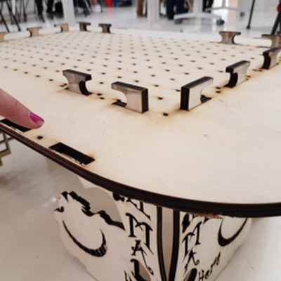
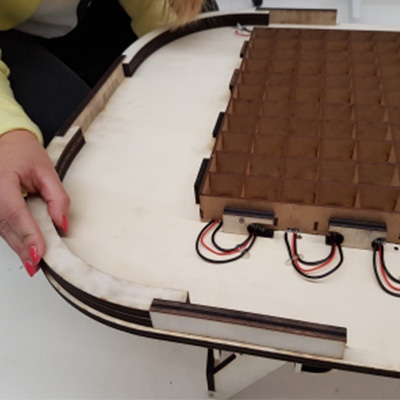

# makers-game


## Material

- 3 plywood boards (1000x600x10mm)
- 1 medium boards (1000x600x3mm)
- 1 PMMA cast sheets (35x400x3mm)
- 1 [Arduino Uno board](https://www.amazon.fr/Elegoo-ATmega328P-ATMEGA16U2-Controller-Microcontr%C3%B4leur/dp/B01N91PVIS/ref=sr_1_3?ie=UTF8&qid=1546870406&sr=8-3&keywords=arduino+uno)
- 1 [prototyping board](https://www.amazon.fr/Adafruit-Perma-Proto-Half-sized-Breadboard-PCB/dp/B00SK8QR8S/ref=sr_1_25?ie=UTF8&qid=1546954746&sr=8-25&keywords=adafruit)
- 1 [Raspberry Pi](https://www.amazon.fr/Raspberry-Pi-Carte-M%C3%A8re-Model/dp/B01CD5VC92/ref=sr_1_3?ie=UTF8&qid=1546870736&sr=8-3&keywords=raspberry+pi+3)
- 1 [micro SD 8Go or more](https://www.amazon.fr/Kingston-Carte-Micro-Classe-Adaptateur/dp/B001CQT0X4/ref=sr_1_1?ie=UTF8&qid=1547134978&sr=8-1&keywords=carte+micro+sd+8go)
- 1 [wire micro USB](https://www.amazon.fr/Samsung-ECB-DU4AWE-C%C3%A2ble-charge-Blanc/dp/B00BCJVMPK/ref=sr_1_24?s=electronics&rps=1&ie=UTF8&qid=1546877205&sr=1-24&keywords=cable+usb+micro+usb&refinements=p_76%3A437879031)
- 1 [wire USB A/MicroB](https://www.amazon.fr/C%C3%A2ble-2-0-M%C3%A2le-couleur-gris/dp/B00O2BKHJM/ref=sr_1_5?ie=UTF8&qid=1546872286&sr=8-5&keywords=cable+usb+ab) **(Normally present with the board Arduino)**
- 7 meters of [LED strip](https://www.amazon.fr/gp/product/B01HLWW9VC/ref=oh_aui_detailpage_o08_s00?ie=UTF8&psc=1)       **(Attention, you will need 7 meters so 2 rolls of 5 meters)**
- [sandpaper](https://www.amazon.fr/Wolfcraft-1741000-Rouleau-Auto-agrippant-Corindon/dp/B001CBZPJM/ref=sr_1_13?s=hi&ie=UTF8&qid=1547042105&sr=1-13&keywords=papier+de+verre) **(Available at the Makers' lab)**
- 16 [wood screws (2,5 x 20mm)](https://www.amazon.fr/Fischer-653020-Power-Fast-frais%C3%A9e-galvanis%C3%A9e/dp/B0070MD33W/ref=sr_1_1?ie=UTF8&qid=1547042054&sr=8-1&keywords=vis+%C3%A0+bois+%282%2C5+x+20mm%29) **(Available at the Makers' lab)**  
- [prototyping wires](https://www.amazon.fr/Ganvol-Assortiment-Multicolore-Prototypage-Raspberry/dp/B076ZM34TM/ref=sr_1_1?ie=UTF8&qid=1547021001&sr=8-1&keywords=fils+prototypage) **(Available at the Makers' lab)**
- 2 [10uF capacitors](https://www.amazon.fr/Condensateur-chimique-radial-10uF-5x12mm/dp/B074CY3YVL/ref=pd_sbs_60_1?_encoding=UTF8&pd_rd_i=B074CY3YVL&pd_rd_r=c44c0817-1288-11e9-9b0f-01dc7c5858cd&pd_rd_w=x3iHt&pd_rd_wg=HhaR7&pf_rd_p=5d361e0c-9e85-4b01-8261-3ff932bec9c8&pf_rd_r=ZM36A88VESV4N7ASMRZT&psc=1&refRID=ZM36A88VESV4N7ASMRZT)
- 10 [10kΩ resistors](https://www.amazon.fr/resistor-film-carbone-resistances-axiales/dp/B01FSDLV1K/ref=sr_1_5?ie=UTF8&qid=1546871577&sr=8-5&keywords=r%C3%A9sistance+10k+ohm)
- 1 [power supply 5V 10A](https://www.amazon.fr/COLM-Adaptateur-Secteur-100-240V-transformateur/dp/B07M5ZXRPG/ref=sr_1_2?ie=UTF8&qid=1546872597&sr=8-2&keywords=power+supply+5v+10a)
- 1 [female adapter](https://www.amazon.fr/Connecteur-broches-alimentation-polaris%C3%A9-Adaptateur/dp/B0754KK8V3/ref=sr_1_5?ie=UTF8&qid=1546872955&sr=8-5&keywords=adaptateur+DC+bornier)
- 10 [arcade button](https://www.amazon.fr/gp/product/B01N5DVINY/ref=oh_aui_detailpage_o09_s00?ie=UTF8&psc=1)


You will also need:

- 1 laser cutter
- 1 soldering iron and a soldering kit
- 1 drilling-screwing machine
- 1 hot glue gun
- 1 tube of wood glue


## Step 1 - Laser cutting

[Download files](https://github.com/emlyon/makers-game/tree/master/fichiers)
& **cut them with the laser cutter** :  

With the **10mm thickness plywood boards**:
- table legs (x4)
- table bottom (x1)
- table top & spare parts (x1) **(If you want to customize your table, this is the file that will be visible)**

Sand the edges to make them clean.


With the **3mm thickness medium**:
-	table outline banner (x4)
-	table grid (x1)  

With the **3mm thickness PMMA**:
- table window (x1)


## Step 2 - Table assembly

**Table legs assembly**:
- Carefully clean the tapped holes for the screws.
- Screw the plywood boards together with a 90° angle.
- Plug and screw the 4 legs into the table bottom.
*Mind the notches !*  




**Grid assembly**:
- Warning: you will need patience!
- The vertical and horizontal battens need to be pressed together all the way.

**Table outline banner setup**:
- Slot and screw the 6 plywood wedges in the table bottom spots.  
- Once the wedges are fixed, place the 4 curvy pieces that will give rounded angles.
- With a pencil, mark the wedges' middles.
- Place and glue the flexwoods from a wedges' middles (use wood glue).
- Flexwoods' ends must meet: use a little piece of medium in order to keep them together.





## Step 3 - Prepare and setup the LED strip

- We used the LED strip **Adafruit Neopixel** (11 x 19 = 209 leds).
- Cut the LED strip into 11 strips of 19 leds.
- Solder the ends of the mini strips to make something looking like a snake (cf. photo): GND - GND /  DIN - DOUT / 5V - 5V.  
*Careful: the wires lenght needs to be big enough to organise the LED strips just like the picture above.*

**Be careful to weld the wires correctly: The 5V/5V, DI/DO and GND/GND. Using cable of different colors will give you more effective markers.**
- Place the LED strip on the table in such a way that every single LED will be aapproximately in the center of a wooden grid cell.


- Connect your LED strip to Arduino Uno (pin 6)
- Test the LED strip soldering using the Arduino Uno. You can use Arduino example "Simple" from the [« Adafruit Neopixel » library](https://github.com/adafruit/Adafruit_NeoPixel). Every LED should light up.
- Once the soldering is tested, secure the solders using a hot glue gun.
- Plug the grid into the table bottom.
- Upload on the Arduino Uno the program [« arcadeTable_arduino »](https://github.com/emlyon/arcadeTable) available on Github.

## Step 4 - Program the Raspberry Pi

### From here, two solutions are available to you:
- Download and flash on the microSD the [final image](https://mega.nz/#!o4VjVQBK!anL8pMjKyosJ1wq7HOHirDserNrnDiyaaCutvMq7loU) of the table with [Etcher.io](https://etcher.io/).
- Take the time to configure the Raspberry to better understand how it works or to modify its behavior.

**Install the Raspberry Pi system**:  
Download and copy the image from [Raspbian Stretch Lite](https://downloads.raspberrypi.org/raspbian_lite_latest) on your Raspberry Pi using [Etcher.io](https://etcher.io/).  
For more details, you can follow the guide: [installing operating system images](https://www.raspberrypi.org/documentation/installation/installing-images/README.md).  
Start your Raspberry Pi using a screen, a keyboard and an ethernet cable connected to your internet box.  
*( default id: pi / password: raspberry )*
**Warning, if you use a French Keyboard,by default the connected keyboard is in QWERTY, the password to type is therefore "rqspberry")**

Once logged in, you can type: `sudo raspi-config` to configurate the language.  
*( en français: http://www.tropfacile.net/doku.php/raspberry-pi/comment-passer-votre-raspberry-en-francais )*  
Install openFrameworks usign the following guide: [Getting your Raspberry Pi ready for openFrameworks](http://openframeworks.cc/setup/raspberrypi/raspberry-pi-getting-started/)  

Once openFrameworks has been installed and tested, you can now install git on your pi. To do this:
```
cd
sudo apt update
sudo apt install git
```
Check that you have well installed git :

```
git --version
```
It is now necessary to download ofxGPIO (important for button management) :

```
cd openFrameworks/addons
git clone https://github.com/kashimAstro/ofxGPIO.git
```
It is now necessary to download the game code:
```
cd /home/pi/openFrameworks/apps/myApps/
git clone https://github.com/emlyon/makers-game-code.git
```
Once downloaded, it is necessary to compile the program, to do this enter the command:
```
cd makers-game-code
make
```

Do not start the program now: you need to connect the Arduino Uno to Raspberry Pi before.
Edit the file `rc.local` in order to launch the game automatically when the Raspberry starts:  
```
sudo nano /etc/rc.local
```
And add the lign `exit`:
```
su pi -c 'cd /home/pi/openFrameworks/apps/myApps/arcadeTable && make run'
```
Click on `Ctrl+x` to quit, then `y` to save.

Finally, restart your Raspberry with the command :
`sudo reboot`


## Step 5 - Electronics

### Take the time to locate :

Start asking yourself where all the elements of your table will be positioned in order to predict your cable length as accurately as possible. Feel free to note these markers with the marker as in the photo:


**The more work there is upstream, the less work there is afterwards.**

### Prepare the buttons :

Start by inserting the buttons on the top of plywood plate.

Turn the plate over so that the cables can be soldered to the buttons:


- Solder red wires on the pins of the buttons to connect all +5V as shown in the picture so that there is only one cable running to the Epoxy card.


- Solder black wires on all the remaining button pins, these go to the epoxy card, plan the cable length accordingly.


### Mount the epoxy Breadboard :
- Attention: Arduino Uno, Raspberry Pi and power supply will be on the side of "Player 1". Therefore, a certain length of wire is required for the arcade buttons of the "Player 2".
- Use male - female cables for the pins to be connected to the Raspberry Pi.
- Use male - male cables for the pins to be connected to the Arduino Uno.

  

### Do not forget to:  
- Connect the Arduino Uno to the Raspberry Pi using a USB-USB cable.  
- Power the Raspberry pi with a micro-USB cable: connect the micro-USB to the Raspberry pi and strip the other side to connect the red and black wires to your epoxy breadboard (cut the white and green wires)

How to **connect the 10 buttons to the Raspberry Pi**:  

Player 1 - UP button: pin 23  
Player 1 - DOWN button: pin 24  
Player 1 - LEFT button: pin 10  
Player 1 - RIGHT button: pin 9  
Player 1 - RESET button: pin 11  

Player 2 - UP button: pin 4  
Player 2 - DOWN button: pin 17  
Player 2 - LEFT button: pin 18  
Player 2 - RIGHT button: pin 27  
Player 2 - RESET button: pin 22  


Be sure to locate your buttons according to the color of the info wire to make sure you connect the right button to the right GPIO.


## Step 6 - Finalize the table
#### Before closing the table, think about doing a final global test to make sure that the system is working properly.


- Using a drill, make a 10mm diameter hole into the table contour strip or underneath for even more transparency.
- Insert the connector for the 5V power supply.
- Place the electronics and cables so that the table can be closed.
- Position the table top correctly and secure it with the wood screws.
- Place the PMMA glass over the grille. This must be maintained by the screen frame.

  


#### You got to the end, well done!
